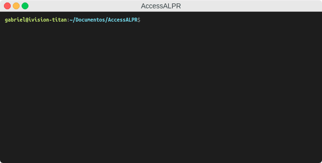
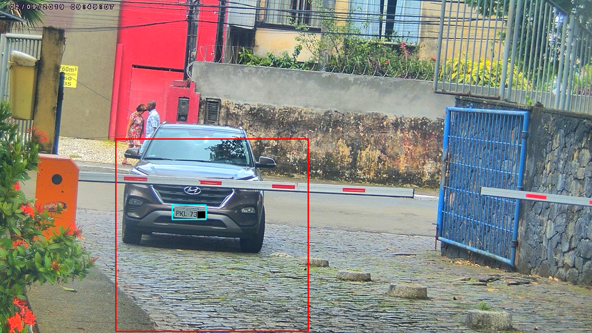

# AccessALPR
### Deep Learning-based ALPR system for vehicle access control trained on brazilian license plates

  
AccessALPR is a semi ad-hoc system developped for robust vehicular access control via images in the wild.

1. [ Features. ](#feats)
2. [ Usage. ](#usage)
3. [ Implementation Details. ](#implementation)
4. [ System Requirements. ](#requirements)
5. [ References. ](#references)

<a name="feats"></a>
#### Features:
  - Frontal and angled plate location powered by YoloV3;
  - Plate recognition independent of character segmentation;
  - Plate recognition for classic brazilian plates and new Mercosul plates in a single model;
  - Majority vote heuristic algorithm for video stream recognition performance increase;
  - Weighted Levenshtein distance costs for plate distance calculation
  - Modular structure (meaning you can easily replace the detection and/or recognition modules to test your own solutions!).

<a name="usage"></a>
#### Usage:

For infering on single images, use `test.py` like this:
```
$ python3 test.py -i sample/01.jpg -o sample/
```
| Argument      | Description   |
| -----------   |   ----------- |
| --input_img, -i      | Path to input image to be analyzed       |
| --output, -o   | Folder where the results are stored. If passed, an image will be saved with the predicted word as the name and the detected plate bounding box plotted.        |
| --read_only, -r   | If passing an already cropped plate, this will pass the image directly to the plate reader        |

Examples:

<table>
    <tr>
        <td></td>
        <td><b>Brazilian Plate</b></td>
        <td><b>New Mercosul Plate</b></td>
        <td><b>Read Only Mode</b></td>
    </tr>
    <tr>
        <td><b>Input Image</b></td>
        <td></td>
        <td></td>
        <td></td>
    </tr>
    <tr>
        <td><b>Output Image</b></td>
        <td></td>
        <td></td>
        <td>'ABC1234'</td>
    </tr>
</table>
          
For usage on a live video feed, we provide `http_stream.py`, capable of parsing and logging detected plates in real time. Since the camera is fixed, we don't need to pass the whole frame to de detector network, and instead we define an anchor as the top left corner and grab a 416x416 square from that area. 
The anchor, HTTP URL, authentication and other configurations can be done by editing the `config.ini` file on the project's root.
```
$ python3 http_stream.py
```

The red square is the section that is being passed to the plate detection network, and the blue square is the detected plate bbox. (Plate partially censored due to privacy concerns)

<a name="implementation"></a>
#### Implementation details:
The weights for the plate detector and plate reader can be downloaded here: [Google Drive](https://drive.google.com/file/d/1KvIcIMOZ0o9xeW6_Q037Lo8S5bfWUrfz/view?usp=sharing). Their paths should be respectively `detector/weights/detector-w.pth` and 
`reader/weights/reader-w.pth`.
Due to the proprietary nature of the datasets used, I'm not at liberty to release them for usage.

##### Plate Detector
YoloV3 (checkout [@eriklindernoren's implementation](https://github.com/eriklindernoren/PyTorch-YOLOv3) he did a great job) on COCO pre-trained and retrained/finetuned for detection of brazilian license plates. Usage via the PlateDetector object (`detector/PlateDetector.py`). 
Accuracy is greatly improved if input images have a 1:1 aspect ratio.

##### Plate Reader
Unlike most ALPR systems, we don't use a character segmentation stage prior to recognition. Segmentation is usually the performance bottleneck in most systems, being the most error prone of them.
We employ an Efficient-Net B0 backbone to extract 252 features from an input image, and then parse that into 7 sets of 36 probabilities. The maximum of each of the 7 is the output letter guessed by the network. This is also very efficient, taking an average of 16ms per prediction (counting the majority vote overhead). Implementation details can be seen on the `reader/PlateReader.py` file.


This approach is arguably less accurate than systems with very accurate segmentation steps on high resolution images, but for our specific applications we achieve competitive results by infering on multiple sequential frames and employing a majority vote algorithm to parse the best result. This is done by using [the Sort tracker](https://github.com/abewley/sort) on the detected bounding boxes. Check `http_stream.py` for an example.


##### Plate Matching
100% match is not always a realistic expectation for unconstraind environments, especially for easily mistakable characters like I and T, K and R, etc. In order to use the prediction for access control, we recommend using Weighted Levenshtein's distance. We computed the [confusion matrix](https://github.com/glefundes/AccessALPR/blob/master/sample/confusion_matrix.png) for individual characters on our dataset, and used it to define substitution costs for the weighted Levenshtein distance algorithm according to the following rule:

where  *n* is the value for the pairing in the normalized confusion matrix.

To obtain the Levenshtein distance, we call the `utils.lev_distance(plate1, plate2)` function to obtain the value. We establish a threshold of 0.2 for considering the plates a match.


##### Pre-Processing (Experimental)

There are multiple optional pre-process algorithms available in `reader/utils.py` in the `PreProcessor` class. CLAHE histogram normalization and different RETINEX algorithms are available and can possibly improve performance in low-light situations. Due to limited dataset resources, we could not prove significant quantitative results, but there is a clear visual improvement when applying the filters. To use them, initialize the plate reader object by passing the `filter=` keyword like this:

```
# Filter options:
#
# 'CLAHE';
# 'RETINEX-CP';
# 'RETINEX-CR';
# 'RETINEX-AUTO'.

plate_reader = PlateReader(filter='CLAHE')
```

It is worth noting that while the best qualitative results are obtained with the Automated RETINEX algorithm, it also introduces significant overhead to the reading process. The RETINEX implementation was taken from [here](https://github.com/dongb5/Retinex).


<a name="requirements"></a>
#### System Requirements:
The code was implemented using Ubuntu 16.04, Python 3.5, Pytorch 1.1.0 and tested to run in real-time on a NVIDIA GTX TITAN 1080.

<a name="references"></a>
#### Other projects and repositories used during implementation:
https://github.com/eriklindernoren/PyTorch-YOLOv3  
https://github.com/abewley/sort  
https://github.com/lukemelas/EfficientNet-PyTorch  
https://github.com/takeitallsource/cnn-traffic-light-evaluation  
https://github.com/dongb5/Retinex  
https://github.com/infoscout/weighted-levenshtein  

Shout out to them, and please check out their great work :)
